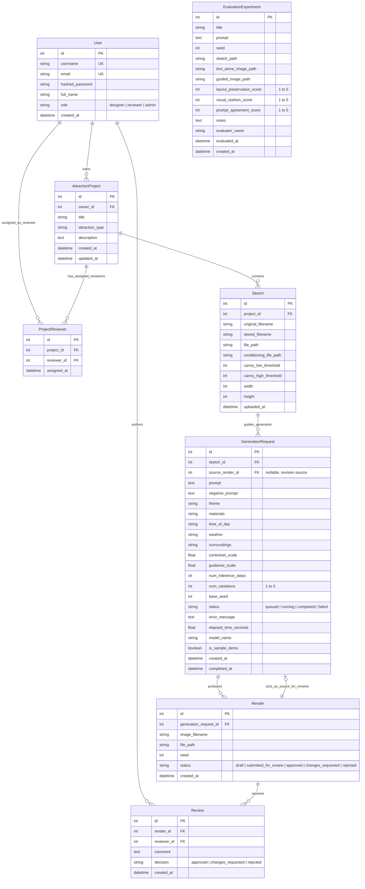

# Sketch2Park — Entity-Relationship (ER) Diagram

The following Mermaid diagram matches the exact SQLAlchemy schema implemented in `backend/app/models.py`.

```mermaid
erDiagram
    User ||--o{ AttractionProject : "owns"
    User ||--o{ ProjectReviewer : "assigned_as_reviewer"
    User ||--o{ Review : "authors"
    
    AttractionProject ||--o{ ProjectReviewer : "has_assigned_reviewers"
    AttractionProject ||--o{ Sketch : "contains"
    
    Sketch ||--o{ GenerationRequest : "guides_generation"
    
    GenerationRequest ||--o{ Render : "produces"
    Render ||--o| GenerationRequest : "acts_as_source_for_revision"
    
    Render ||--o{ Review : "receives"

    User {
        int id PK
        string username UK
        string email UK
        string hashed_password
        string full_name
        string role "designer | reviewer | admin"
        datetime created_at
    }

    AttractionProject {
        int id PK
        int owner_id FK
        string title
        string attraction_type
        text description
        datetime created_at
        datetime updated_at
    }

    ProjectReviewer {
        int id PK
        int project_id FK
        int reviewer_id FK
        datetime assigned_at
    }

    Sketch {
        int id PK
        int project_id FK
        string original_filename
        string stored_filename
        string file_path
        string conditioning_file_path
        int canny_low_threshold
        int canny_high_threshold
        int width
        int height
        datetime uploaded_at
    }

    GenerationRequest {
        int id PK
        int sketch_id FK
        int source_render_id FK "nullable, revision source"
        text prompt
        text negative_prompt
        string theme
        string materials
        string time_of_day
        string weather
        string surroundings
        float controlnet_scale
        float guidance_scale
        int num_inference_steps
        int num_variations "1 to 3"
        int base_seed
        string status "queued | running | completed | failed"
        text error_message
        float elapsed_time_seconds
        string model_name
        boolean is_sample_demo
        datetime created_at
        datetime completed_at
    }

    Render {
        int id PK
        int generation_request_id FK
        string image_filename
        string file_path
        int seed
        string status "draft | submitted_for_review | approved | changes_requested | rejected"
        datetime created_at
    }

    Review {
        int id PK
        int render_id FK
        int reviewer_id FK
        text comment
        string decision "approved | changes_requested | rejected"
        datetime created_at
    }

    EvaluationExperiment {
        int id PK
        string title
        text prompt
        int seed
        string sketch_path
        string text_alone_image_path
        string guided_image_path
        int layout_preservation_score "1 to 5"
        int visual_realism_score "1 to 5"
        int prompt_agreement_score "1 to 5"
        text notes
        string evaluator_name
        datetime evaluated_at
        datetime created_at
    }
```
